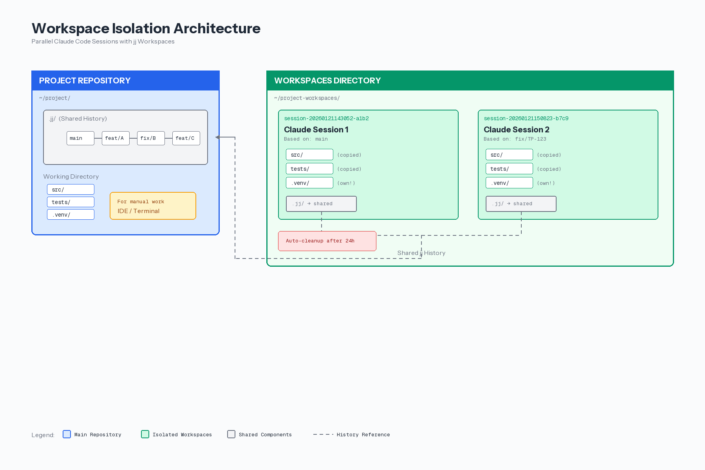
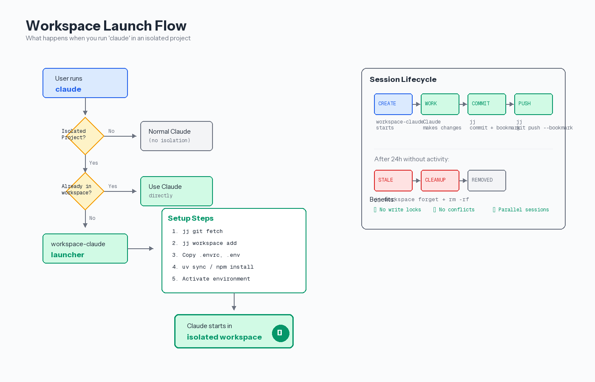

# Parallel Claude Code Sessions Without Git Conflicts

## (Side Note) What's a jj workspace?

It's simply a different directory that uses the same jj repository and shared history. From your perspective, it looks like having several "clones" of the same project, but moving commits between them is much easier than if you had cloned multiple times. You can easily try it yourself:

```bash
cd my-project
jj workspace add /some/path/to/somewhere
# clean up again
jj workspace forget somewhere # directory name is the workspace name
rm -rf /some/path/to/somewhere
```

## How I run multiple AI sessions on the same repo using jj workspaces

We've been using Claude Code heavily on our BDD test framework - and quickly hit a wall. One Claude instance per repo just isn't enough when you're juggling multiple tasks. You want one session refactoring the auth module while another writes tests and a third fixes that production bug someone just reported.

The problem? Out of the box, this doesn't work. Write locks block parallel sessions. Uncommitted changes from different tasks pile up in the same working directory. Files from Task A accidentally get committed to Task B's branch. It's chaos.

We solved this using jj (Jujutsu) workspaces. Each Claude session gets its own isolated working directory with its own `.venv`, but they all share the same git history. No locks, no conflicts, no accidental cross-contamination of changes. Just spin up as many Claude sessions as you need.

```
# Terminal 1
cd myproject && claude
→ Creates workspace session-20260121-143052-a1b2, launches Claude

# Terminal 2
cd myproject && claude
→ Creates workspace session-20260121-143058-c3d4, launches Claude

# Both work independently, no conflicts
```

---

## How It Works



Each workspace is a complete copy of your project files, but jj's magic is that they all share the same commit graph. Changes made in one workspace can be pushed to a branch and immediately seen by others.

**Key concepts:**
- **Main Repository** (blue): Your original project with `.jj/` containing the shared history
- **Workspaces** (green): Isolated copies with their own `.venv` but pointing to the same jj history
- **Shared History** (gray): All workspaces see the same commits, branches, and changes

---

## The Flow



When you run `claude` in a project configured for workspace isolation:

1. Shell function checks if current directory is in `WORKSPACE_ISOLATED_PROJECTS`
2. If already in a workspace (`*-workspaces/`), uses Claude directly
3. Otherwise, `workspace-claude` launcher creates a new isolated workspace
4. Setup runs automatically (`jj git fetch`, `uv sync`, etc.)
5. Claude starts in the fresh, isolated environment

---

## Lessons Learned (Jan 2026)

Building this wasn't straightforward. Here are the gotchas that cost me hours:

### 1. stdout Pollution

**Problem:** Setup commands (`uv sync`, `npm install`) write to stdout. When you capture their output in a variable, you get garbage instead of the workspace path.

```bash
# ❌ Broken - uv output ends up in workspace_path
workspace_path=$(create_workspace ...)

# ✅ Fixed - All logs to stderr, setup output to /dev/null
log_info() { echo "..." >&2; }  # stderr!
uv sync >/dev/null 2>&1
```

### 2. Empty Arrays in Bash

**Problem:** `set -u` (unset variable check) crashes on empty arrays.

```bash
# ❌ Crashes when CLAUDE_ARGS is empty
exec claude "${CLAUDE_ARGS[@]}"

# ✅ Fixed - "expand if set" syntax
exec claude ${CLAUDE_ARGS[@]+"${CLAUDE_ARGS[@]}"}
```

### 3. Session ID Collisions

**Problem:** Using only the date as ID means all sessions on the same day get the same name.

```bash
# ❌ Only 8 chars = date only
short_id="${session_id:0:8}"  # → session-20260121

# ✅ Fixed - 19 chars = timestamp + random
short_id="${session_id:0:19}" # → session-20260121143052-a3f2
```

### 4. Wrong Claude Version

**Problem:** mise-managed node shadows the system Claude binary.

```bash
# ❌ Broken - picks up wrong claude after mise activate
exec claude "$@"

# ✅ Fixed - capture path BEFORE mise
CLAUDE_BIN=$(command -v claude)
eval "$(mise activate bash)"
exec "$CLAUDE_BIN" "$@"
```

---

## Why jj Instead of Git Worktrees?

| Feature | Git Worktrees | jj Workspaces |
|---------|---------------|---------------|
| Setup | `git worktree add` | `jj workspace add` |
| History | Shared refs | Fully shared |
| Cleanup | Manual | Auto via script |
| Conflicts | Branch checkout needed | Direct revisions |
| IDE Support | Good | Less |

jj workspaces are "first-class citizens" - creating and managing them is seamless. Git worktrees require more manual management.

---

## When NOT to Use This

- **Solo projects:** If you only ever run one session at a time
- **Small repos:** Overhead isn't worth it
- **No jj:** Only works with Jujutsu as VCS
- **CI/CD:** Isolation doesn't make sense there

---

## Quick Start

See the separate setup file for complete installation instructions:
**[workspace-isolation-setup.md](./workspace-isolation-setup.md)**

TL;DR:
```bash
brew install jj
cd your-project && jj git init --colocate
# Copy the workspace-claude script to ~/.local/bin/
# Add shell function to ~/.zshrc
# Done - `claude` now auto-creates isolated workspaces
```

---

*Last updated: 2026-01-21*
